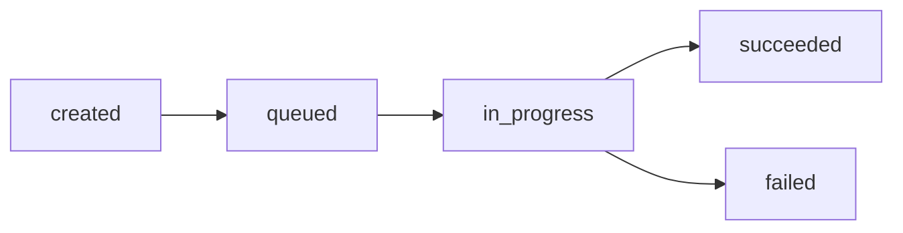

# Deployments API

Deployments represent versions of your app that are deployed to the Spice runtime. Each deployment creates or updates a Kubernetes deployment with your app's spicepod configuration.

## List Deployments

`GET` `https://api.spice.ai/v1/apps/{appId}/deployments`

Returns a list of deployments for the specified app, ordered by creation time (newest first).

**Required scope:** `deployments:read`

### Path Parameters

| Parameter | Type    | Description |
| --------- | ------- | ----------- |
| `appId`   | integer | The app ID  |

### Query Parameters

| Parameter | Type    | Default | Description                                                                    |
| --------- | ------- | ------- | ------------------------------------------------------------------------------ |
| `limit`   | integer | 20      | Maximum number of deployments to return (max: 100)                             |
| `status`  | string  | -       | Filter by status: `queued`, `in_progress`, `succeeded`, `failed`, or `created` |

### Response

<Tabs>
<Tab title="200: OK">
```json
{
  "deployments": [
    {
      "id": 456,
      "status": "succeeded",
      "created_at": "2024-01-15T10:30:00.000Z",
      "updated_at": "2024-01-15T10:32:00.000Z",
      "image_tag": "v0.17.0",
      "replicas": 2,
      "branch": "main",
      "commit_sha": "abc123def456",
      "commit_message": "Add new dataset",
      "error_message": null,
      "creation_source": "api",
      "created_by": "user@example.com"
    },
    {
      "id": 455,
      "status": "failed",
      "created_at": "2024-01-15T09:00:00.000Z",
      "updated_at": "2024-01-15T09:05:00.000Z",
      "image_tag": "v0.16.5",
      "replicas": 2,
      "branch": "main",
      "commit_sha": "def456ghi789",
      "commit_message": "Update configuration",
      "error_message": "Failed to pull container image",
      "creation_source": "portal",
      "created_by": "user@example.com"
    }
  ]
}
```

**Response Fields:**

| Field             | Type           | Description                                                             |
| ----------------- | -------------- | ----------------------------------------------------------------------- |
| `id`              | integer        | Unique deployment identifier                                            |
| `status`          | string         | Deployment status (see Status Values below)                             |
| `created_at`      | string         | ISO 8601 timestamp when deployment was created                          |
| `updated_at`      | string \| null | ISO 8601 timestamp when deployment was last updated                     |
| `image_tag`       | string \| null | Spice runtime image tag used                                            |
| `replicas`        | integer        | Number of replicas deployed                                             |
| `branch`          | string \| null | Git branch name                                                         |
| `commit_sha`      | string \| null | Git commit SHA                                                          |
| `commit_message`  | string \| null | Git commit message                                                      |
| `error_message`   | string \| null | Error message if deployment failed                                      |
| `creation_source` | string \| null | Source that triggered the deployment (`api`, `portal`, `github`, `cli`) |
| `created_by`      | string \| null | User who created the deployment                                         |

**Status Values:**

| Status        | Description                                  |
| ------------- | -------------------------------------------- |
| `queued`      | Deployment is queued and waiting to start    |
| `in_progress` | Deployment is currently in progress          |
| `succeeded`   | Deployment completed successfully            |
| `failed`      | Deployment failed (see `error_message`)      |
| `created`     | Deployment record created but not yet queued |
</Tab>

<Tab title="404: Not Found">
```json
{
  "error": "App with ID 123 not found"
}
```
</Tab>
</Tabs>

### Examples

**List all deployments:**

```bash
curl -H "Authorization: Bearer <token>" 
  https://api.spice.ai/v1/apps/123/deployments
```

**List last 10 deployments:**

```bash
curl -H "Authorization: Bearer <token>" 
  "https://api.spice.ai/v1/apps/123/deployments?limit=10"
```

**List only successful deployments:**

```bash
curl -H "Authorization: Bearer <token>" 
  "https://api.spice.ai/v1/apps/123/deployments?status=succeeded"
```

**Python:**

```python
import requests

response = requests.get(
    f"https://api.spice.ai/v1/apps/{app_id}/deployments",
    headers={"Authorization": f"Bearer {token}"},
    params={"limit": 10, "status": "succeeded"}
)

deployments = response.json()["deployments"]
for deployment in deployments:
    print(f"Deployment {deployment['id']}: {deployment['status']}")
```

## Create Deployment

`POST` `https://api.spice.ai/v1/apps/{appId}/deployments`

Creates a new deployment for the specified app using the app's current spicepod configuration. The deployment is queued and processed asynchronously.

**Required scope:** `deployments:write`

### Path Parameters

| Parameter | Type    | Description |
| --------- | ------- | ----------- |
| `appId`   | integer | The app ID  |

### Request Body

All fields are optional. If not provided, the app's current configuration is used.

```json
{
  "image_tag": "v0.17.1",
  "replicas": 3,
  "branch": "main",
  "commit_sha": "abc123def456",
  "commit_message": "Deploy latest changes",
  "debug": false
}
```

**Request Fields:**

| Field            | Type    | Description                                              |
| ---------------- | ------- | -------------------------------------------------------- |
| `image_tag`      | string  | Override the Spice runtime image tag for this deployment |
| `replicas`       | integer | Override the number of replicas (1-10)                   |
| `branch`         | string  | Git branch name (for tracking)                           |
| `commit_sha`     | string  | Git commit SHA (for tracking)                            |
| `commit_message` | string  | Git commit message (for tracking)                        |
| `debug`          | boolean | Enable debug mode                                        |

### Response

<Tabs>
<Tab title="202: Accepted">
```json
{
  "id": 457,
  "status": "queued",
  "created_at": "2024-01-15T11:00:00.000Z",
  "updated_at": null,
  "image_tag": "v0.17.1",
  "replicas": 3,
  "branch": "main",
  "commit_sha": "abc123def456",
  "commit_message": "Deploy latest changes",
  "error_message": null,
  "creation_source": "api",
  "created_by": null
}
```

The deployment has been created and queued for processing. Poll the deployment status using the returned `id`.
</Tab>

<Tab title="400: Bad Request">
```json
{
  "error": "App has no spicepod configuration. Update the app with a spicepod before deploying."
}
```

or

```json
{
  "error": "Validation error",
  "details": {
    "fieldErrors": {
      "replicas": ["Replicas must be between 1 and 10"]
    }
  }
}
```
</Tab>

<Tab title="404: Not Found">
```json
{
  "error": "App with ID 123 not found"
}
```
</Tab>

<Tab title="409: Conflict">
```json
{
  "error": "A deployment is already in progress for this app",
  "activeDeploymentId": 456
}
```

Only one deployment can be in progress at a time. Wait for the current deployment to complete or fail before creating a new one.
</Tab>
</Tabs>

### Examples

**Deploy with current configuration:**

```bash
curl -X POST https://api.spice.ai/v1/apps/123/deployments 
  -H "Authorization: Bearer <token>" 
  -H "Content-Type: application/json"
```

**Deploy with Git metadata:**

```bash
curl -X POST https://api.spice.ai/v1/apps/123/deployments 
  -H "Authorization: Bearer <token>" 
  -H "Content-Type: application/json" 
  -d '{
    "branch": "main",
    "commit_sha": "abc123def456",
    "commit_message": "Add sales dataset"
  }'
```

**Deploy with version override:**

```bash
curl -X POST https://api.spice.ai/v1/apps/123/deployments 
  -H "Authorization: Bearer <token>" 
  -H "Content-Type: application/json" 
  -d '{
    "image_tag": "v0.17.1",
    "replicas": 5
  }'
```

**Python Example:**

```python
import requests
import time

# Create deployment
response = requests.post(
    f"https://api.spice.ai/v1/apps/{app_id}/deployments",
    headers={
        "Authorization": f"Bearer {token}",
        "Content-Type": "application/json"
    },
    json={
        "branch": "main",
        "commit_sha": commit_sha,
        "commit_message": commit_message
    }
)

deployment = response.json()
deployment_id = deployment["id"]
print(f"Deployment {deployment_id} created with status: {deployment['status']}")

# Poll deployment status
while True:
    response = requests.get(
        f"https://api.spice.ai/v1/apps/{app_id}/deployments",
        headers={"Authorization": f"Bearer {token}"},
        params={"limit": 1}
    )

    latest = response.json()["deployments"][0]
    if latest["id"] == deployment_id:
        status = latest["status"]
        print(f"Deployment status: {status}")

        if status == "succeeded":
            print("Deployment successful!")
            break
        elif status == "failed":
            print(f"Deployment failed: {latest['error_message']}")
            break
        elif status in ["queued", "in_progress"]:
            time.sleep(5)  # Wait 5 seconds before checking again
        else:
            break
```

**Node.js Example with Async/Await:**

```javascript
async function deployApp(appId, config) {
  // Create deployment
  const response = await fetch(
    `https://api.spice.ai/v1/apps/${appId}/deployments`,
    {
      method: 'POST',
      headers: {
        'Authorization': `Bearer ${token}`,
        'Content-Type': 'application/json'
      },
      body: JSON.stringify(config)
    }
  );

  const deployment = await response.json();
  console.log(`Deployment ${deployment.id} created`);

  // Poll for completion
  while (true) {
    const statusResponse = await fetch(
      `https://api.spice.ai/v1/apps/${appId}/deployments?limit=1`,
      {
        headers: { 'Authorization': `Bearer ${token}` }
      }
    );

    const data = await statusResponse.json();
    const latest = data.deployments[0];

    if (latest.id === deployment.id) {
      console.log(`Status: ${latest.status}`);

      if (latest.status === 'succeeded') {
        console.log('Deployment successful!');
        return latest;
      } else if (latest.status === 'failed') {
        throw new Error(`Deployment failed: ${latest.error_message}`);
      } else if (['queued', 'in_progress'].includes(latest.status)) {
        await new Promise(resolve => setTimeout(resolve, 5000));
      }
    }
  }
}

// Usage
try {
  await deployApp(123, {
    branch: 'main',
    commit_sha: 'abc123',
    commit_message: 'Deploy latest changes'
  });
} catch (error) {
  console.error('Deployment failed:', error);
}
```

## Deployment Workflow

1. **Configure App** - Update the app's spicepod configuration using the [Apps API](apps)
2. **Create Deployment** - POST to `/v1/apps/{appId}/deployments`
3. **Monitor Status** - Poll GET `/v1/apps/{appId}/deployments` until status is `succeeded` or `failed`
4. **Check Logs** - If deployment fails, check `error_message` for details

## Deployment Status Flow



## Prerequisites

Before creating a deployment, ensure:

1. **App exists** - The app must be created via the Apps API
2. **Spicepod configured** - The app must have a valid spicepod configuration
3. **API key exists** - The app must have an API key (automatically generated)
4. **No concurrent deployments** - Only one deployment can be in progress at a time

## Common Error Messages

| Error                                 | Cause                           | Solution                                                |
| ------------------------------------- | ------------------------------- | ------------------------------------------------------- |
| "App has no spicepod configuration"   | App doesn't have a spicepod     | Update app with a spicepod using PUT `/v1/apps/{appId}` |
| "A deployment is already in progress" | Another deployment is running   | Wait for the current deployment to complete             |
| "Spicepod is paused"                  | App has been paused             | Restore the app before deploying                        |
| "Failed to pull container image"      | Invalid or inaccessible image   | Check the `image_tag` and `registry` configuration      |
| "Invalid spicepod configuration"      | Spicepod YAML/JSON is malformed | Validate the spicepod syntax                            |

## Best Practices

### Deployment Tracking

- Always include `branch`, `commit_sha`, and `commit_message` for traceability
- Use descriptive commit messages that explain what's being deployed
- Tag deployments with environment metadata using app tags

### Monitoring

- Poll deployment status with exponential backoff (5s, 10s, 20s, ...)
- Set a maximum wait time (e.g., 10 minutes) before timing out
- Store deployment IDs for audit trails and rollback tracking

### Error Handling

- Check for `409 Conflict` errors and wait for concurrent deployment to complete
- Parse `error_message` for troubleshooting failed deployments
- Implement retry logic with backoff for transient failures

### CI/CD Integration

```yaml
# GitHub Actions example
- name: Deploy to Spice
  run: |
    DEPLOYMENT=$(curl -X POST https://api.spice.ai/v1/apps/${{ secrets.APP_ID }}/deployments 
      -H "Authorization: Bearer ${{ secrets.SPICE_PAT }}" 
      -H "Content-Type: application/json" 
      -d '{
        "branch": "${{ github.ref_name }}",
        "commit_sha": "${{ github.sha }}",
        "commit_message": "${{ github.event.head_commit.message }}"
      }')

    DEPLOYMENT_ID=$(echo $DEPLOYMENT | jq -r '.id')
    echo "Deployment ID: $DEPLOYMENT_ID"

    # Poll for completion
    for i in {1..60}; do
      STATUS=$(curl -H "Authorization: Bearer ${{ secrets.SPICE_PAT }}" 
        "https://api.spice.ai/v1/apps/${{ secrets.APP_ID }}/deployments?limit=1" 
        | jq -r '.deployments[0].status')

      echo "Status: $STATUS"

      if [ "$STATUS" = "succeeded" ]; then
        echo "Deployment successful!"
        exit 0
      elif [ "$STATUS" = "failed" ]; then
        echo "Deployment failed!"
        exit 1
      fi

      sleep 10
    done

    echo "Deployment timed out"
    exit 1
```

### Terraform

Use the `spiceai_deployment` resource to manage deployments. See [Terraform Provider](terraform#spiceai_deployment) for full documentation.

```hcl
resource "spiceai_deployment" "example" {
  app_id    = spiceai_app.example.id
  image_tag = "v0.18.0"
  replicas  = 3
}
```

See also:

- [Apps API](apps) - Configure your app before deploying
- [Secrets API](secrets) - Manage secrets used by your app
- [Portal Deployments](../../portal/app-spicepod/deployments) - View deployments in the portal
