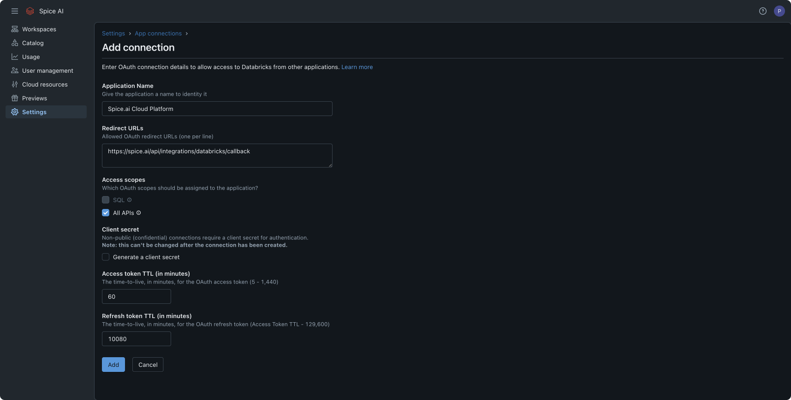
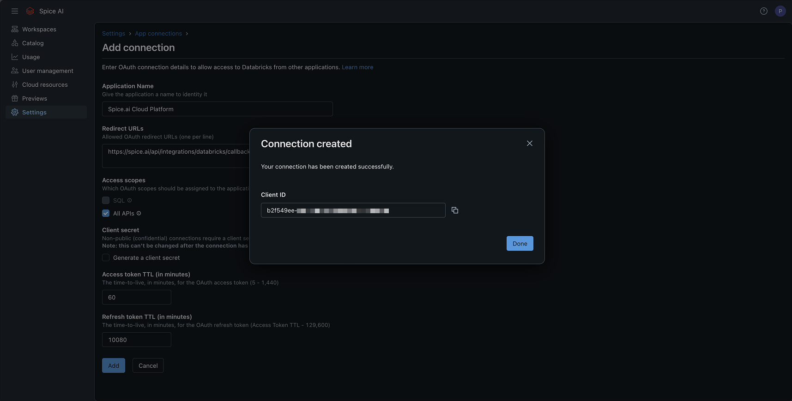
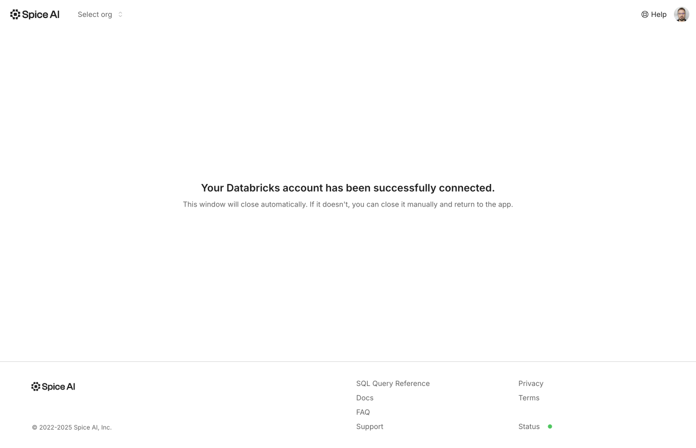

# Databricks


Databricks OAuth connections require Spice.ai v1.4.0 or higher.


### Create Databricks App Connection

To connect Spice Cloud to your Databricks workspace, create a new App connection in your workspace settings with the following configuration:

* **Application Name**: `Spice Cloud Platform`
* **Redirect URLs**: `https://spice.ai/api/integrations/databricks/callback`&#x20;
* **Access scopes**: `All Apis`
* **Client secret generation:** `disabled`

<figure><figcaption>
Add new Databricks OAuth connection
</figcaption></figure>

After creating the connection, copy the generated OAuth client ID:

<figure><figcaption>
Copy Databricks Client ID
</figcaption></figure>

### Configure Databricks Connection in Spice Cloud

Navigate to the code editor and select the Databricks connector. Choose either SQL Warehouse or Delta Lake mode, then select the OAuth authorization option. Click **Connect Databricks Workspace** to proceed.

<figure><figcaption>
Databricks connector in code editor
</figcaption></figure>

Enter the workspace URL and OAuth Client ID generated from the Databricks OAuth app, then click **Connect**.

<figure><figcaption>
Set Databricks workspace URL and Client ID
</figcaption></figure>

After successful authentication in Databricks, you will be redirected back to the Spice app:


Note: Databricks authentication credentials are only stored client-side in your browser and never in Spice Cloud.


<figure><figcaption>
Successful connection
</figcaption></figure>

Once connected, Databricks datasets, catalogs, and models can use the connection:

<figure><figcaption>
Code editor with Databricks catalog, dataset and model
</figcaption></figure>
