# GitHub Copilot

The [Spice AI GitHub Copilot Extension](https://github.com/marketplace/spice-ai-for-github-copilot) makes it easy to access and chat with external data in GitHub Copilot, enhancing AI-assisted research, Q\&A, code, and documentation suggestions for greater accuracy.

<figure><figcaption>
The @spiceai extension in GitHub Copilot.
</figcaption></figure>

Access structured and unstructured data from any Spice data source like GitHub, PostgreSQL, MySQL, Snowflake, Databricks, GraphQL, data lakes (S3, Delta Lake, OneLake), HTTP(s), SharePoint, and even FTP.

Some example prompts:

* **`@spiceai`**` ``What documentation is relevant to this file?`
* **`@spiceai`**` ``Write documentation about the user authentication issue`
* **`@spiceai`**` ``Who are the top 5 committers to this repository?`
* **`@spiceai`**` ``What are the latest error logs from my web app?`

## Installing the Spice.ai for GitHub Copilot Extension

To install the extension, visit the [GitHub Marketplace](https://github.com/marketplace/spice-ai-for-github-copilot) and search for **Spice.ai**.

<figure><figcaption>
The Spice.ai Extension in the GitHub Marketplace.
</figcaption></figure>

Scroll down, and click **Install it for free**.

<figure><figcaption>
Install the Community Edition of the Spice.ai Extension for free.
</figcaption></figure>

## Configuring the extension

1. Once installed, open Copilot Chat and type `@spiceai`. Press enter.

<figure>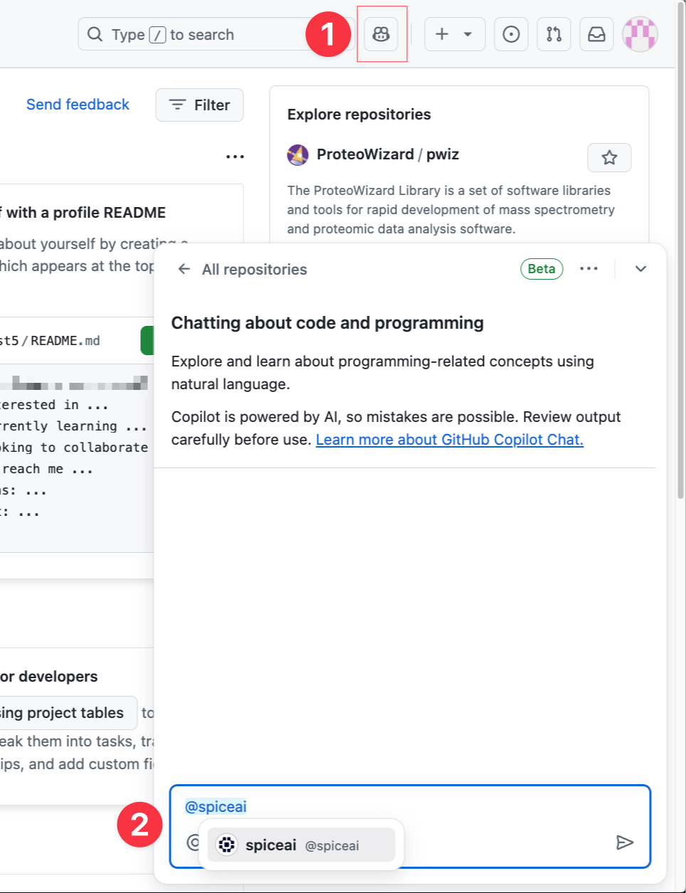<figcaption>
Starting a conversaton with @spiceai
</figcaption></figure>

2. A prompt will appear to connect to the Spice.ai Cloud Platform.

<figure>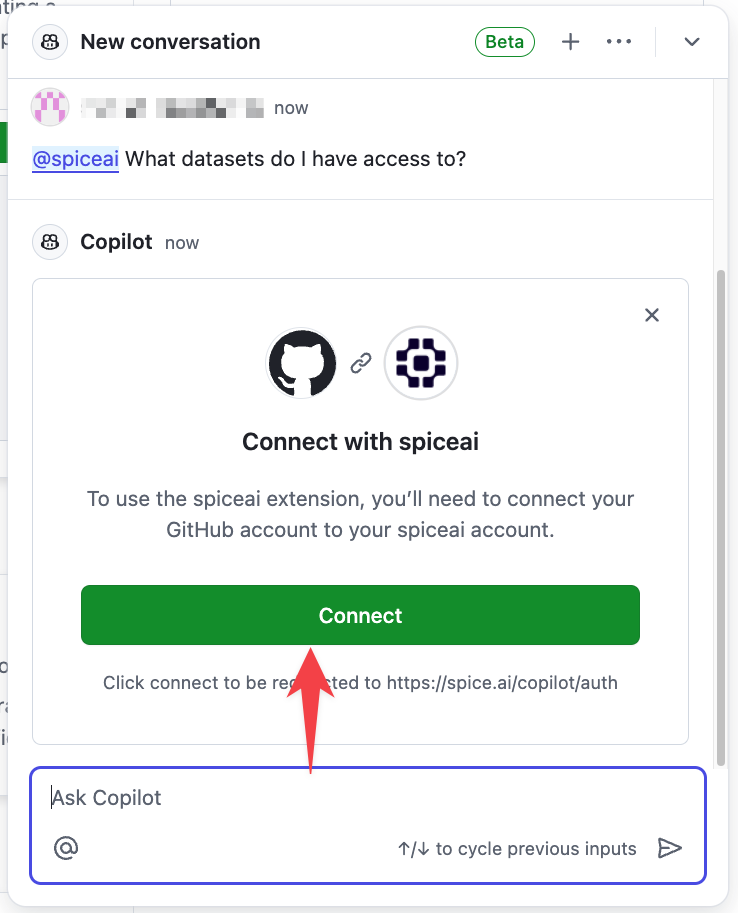<figcaption>
Connection prompt
</figcaption></figure>

3. You will need to authorize the extension. Click **Authorize spiceai**.

<figure>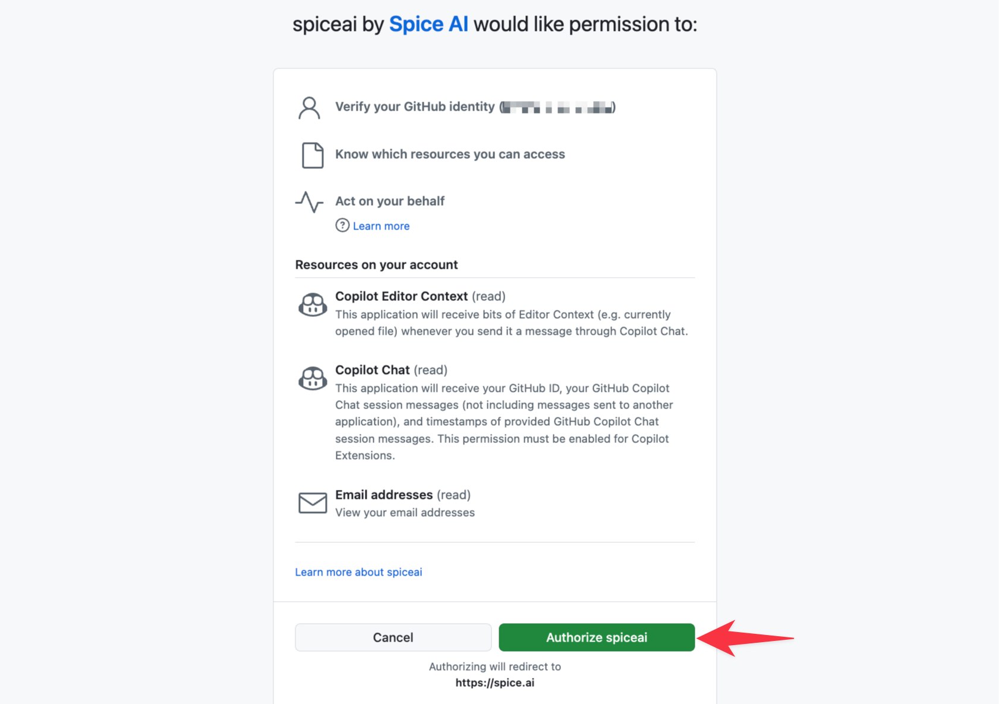<figcaption>
Permissions screen for the Spice AI Extension
</figcaption></figure>

4. To create an account on the Spice.ai Cloud Platform, click **Authorize Spice AI Platform.**

<figure>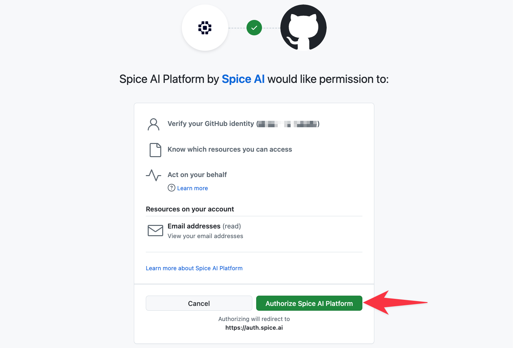<figcaption>
Authorizing the Spice.ai Cloud Platform
</figcaption></figure>

5. Once your account is created, you can configure the extension. Select from a set of ready-to-use datasets to get started. You can configure other datasets after setup.

<figure>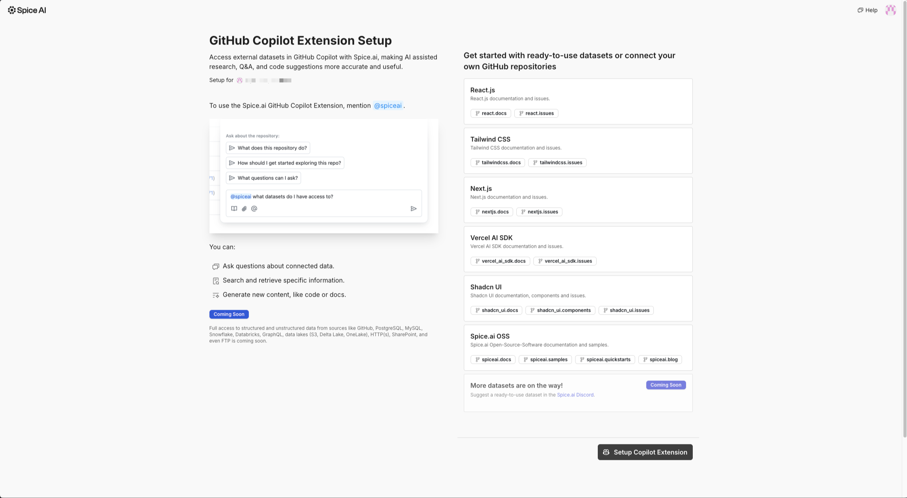<figcaption>
GitHub Copilot Extension Setup page
</figcaption></figure>

<figure>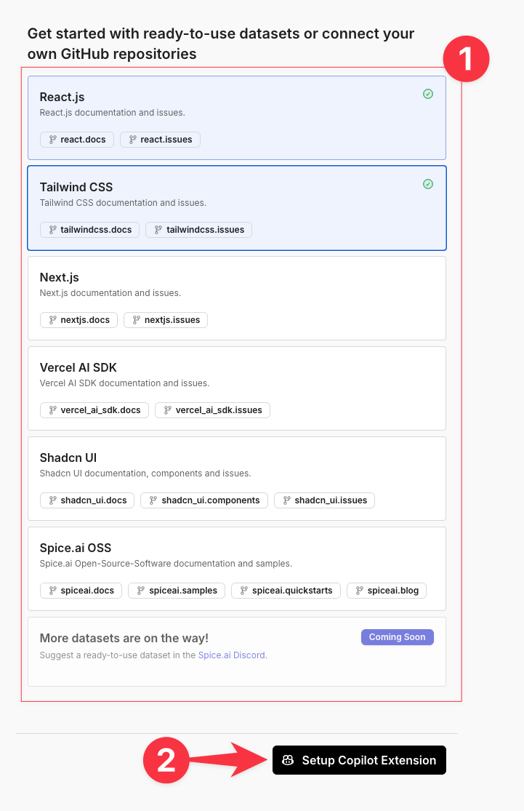<figcaption></figcaption></figure>

6. The extension will take up to 30 seconds to deploy and load the initial dataset.

<figure>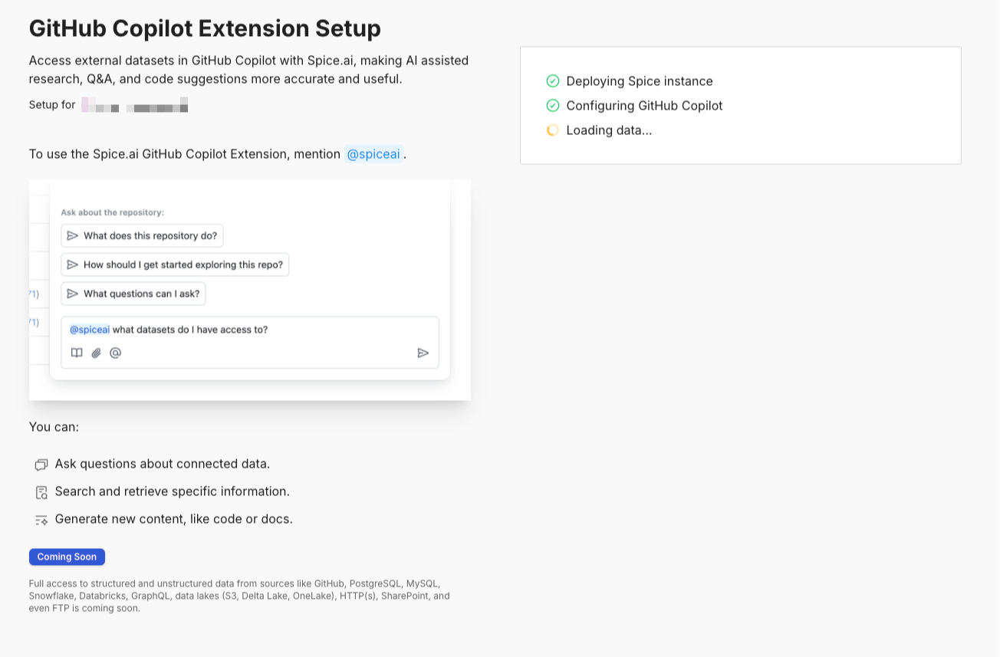<figcaption>
GitHub Copilot Extension Deployment page
</figcaption></figure>

7. When complete, proceed back to **GitHub Copilot Chat**.

## Chatting with Copilot Chat

### Start a new chat

To chat with the **Spice.ai for GitHub Copilot** extension, prefix the message with `@spiceai`

<figure><figcaption></figcaption></figure>


If `@spiceai` does not appear in the popup <mark style="color:red;">(2)</mark>, ensure that all the [installation](github-copilot.md) steps have been followed.&#x20;


### Querying which datasets are available

To list the datasets available to Copilot, try `@spiceai What datasets do I have access to?`

<figure><figcaption></figcaption></figure>

<figure>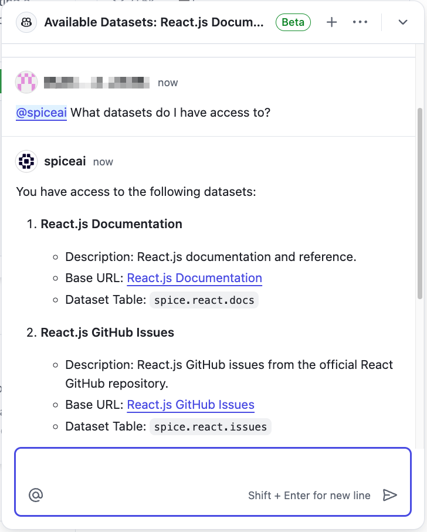<figcaption></figcaption></figure>

### Querying data using SQL



### Navigate to [Spice.ai](https://spice.ai) and click <mark style="color:purple;">Portal</mark>&#x20;




### Click the `copilot` app

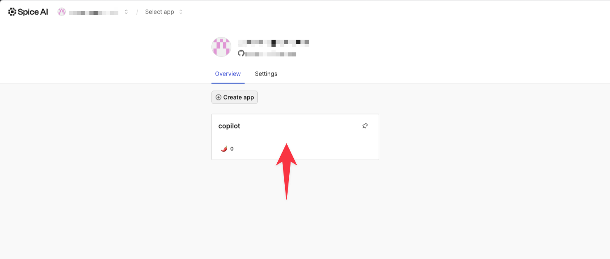

This will open the Spice.ai playground



### List the tables available

Run `show tables` to list the tables that are available to the Copilot extension

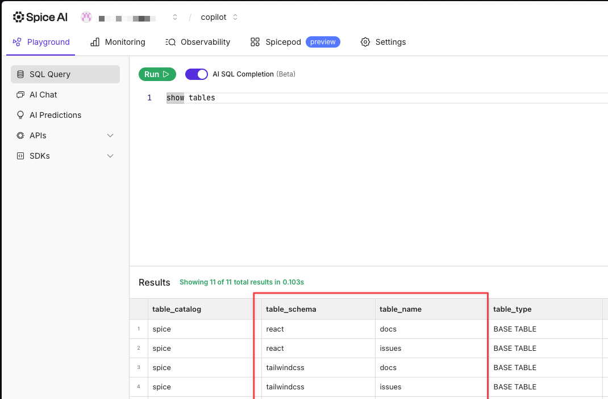



### Querying repository content

To query the GitHub content, query one of the tables above like so:

> `SELECT name, path, url, content_embedding FROM react.docs LIMIT 10;`

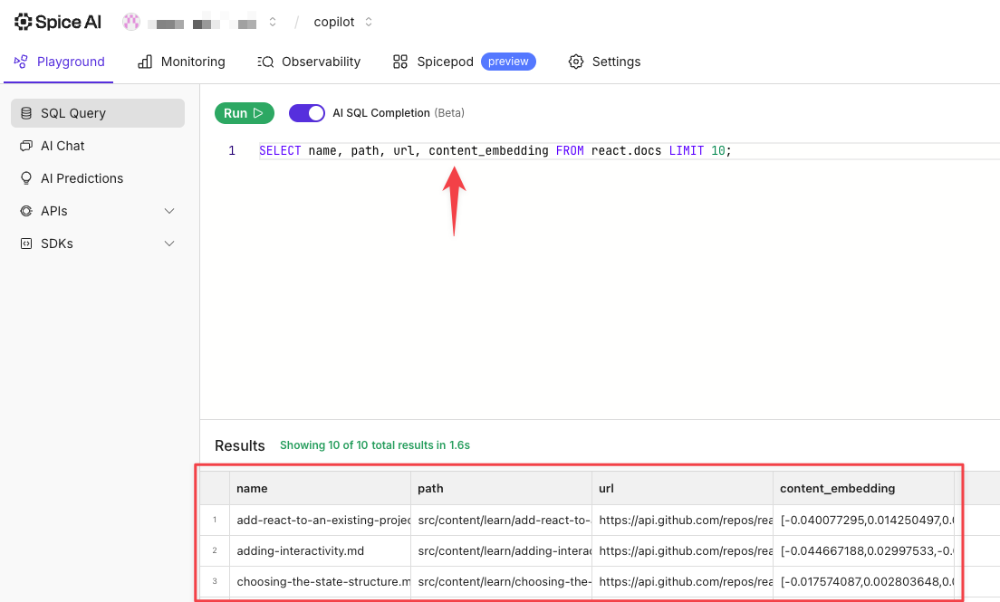



## Reset the Copilot instance



### Navigate to [spice.ai](https://spice.ai) and click <mark style="color:purple;">Portal</mark>




### Open the account menu in the top-right corner

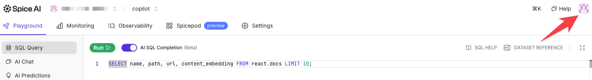



### Click <mark style="color:purple;">Account Settings</mark>

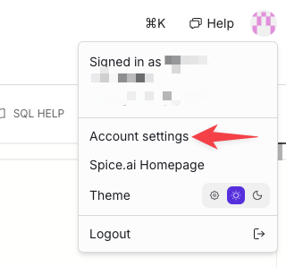



### Click <mark style="color:purple;">GitHub Copilot</mark>

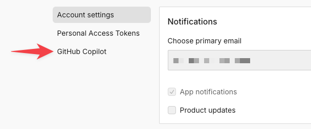



### Click <mark style="color:purple;">Reset GitHub Copilot config</mark>

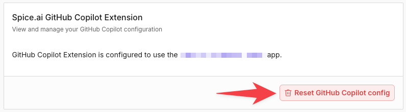



